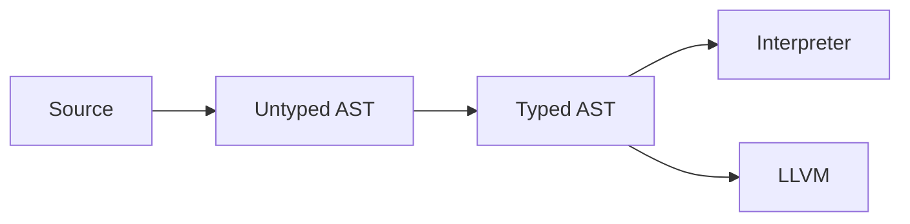

## Suggested Approach for Parsing

```csharp
public abstract record Expr
{
    public record Literal(object Value) : Expr;
    public record Binary(Expr Left, Token Operator, Expr Right) : Expr;
    public record Call(Expr Callee, List<Expr> Arguments) : Expr;
    public record Lambda(List<Parameter> Params, Expr Body) : Expr;
    // ... etc
}

// Usage is very clean:
public object Evaluate(Expr expr) => expr switch
{
    Expr.Literal lit => lit.Value,
    Expr.Binary bin => EvaluateBinary(bin.Left, bin.Operator, bin.Right),
    Expr.Call call => EvaluateCall(call.Callee, call.Arguments),
    Expr.Lambda lambda => new LambdaFunction(lambda.Params, lambda.Body),
    _ => throw new InvalidOperationException($"Unknown expression type: {expr}")
};

// Base types
public abstract record AstNode;
public abstract record Expr : AstNode;
public abstract record Stmt : AstNode;
public abstract record Pattern : AstNode;  // For your pattern matching
public abstract record TypeAnnotation : AstNode;  // For your type system

// Expression types
public abstract record Expr : AstNode
{
    public record Literal(object Value) : Expr;
    public record Identifier(string Name) : Expr;
    public record Binary(Expr Left, Token Operator, Expr Right) : Expr;
    public record Call(Expr Callee, List<Expr> Arguments) : Expr;
    public record MethodCall(Expr Object, string Method, List<Expr> Arguments) : Expr;
    public record Lambda(List<Parameter> Parameters, Expr Body) : Expr;
    public record Match(Expr Expression, List<MatchArm> Arms) : Expr;
    public record ArrayLiteral(List<Expr> Elements) : Expr;
    public record TupleLiteral(List<Expr> Elements) : Expr;
    public record EnumConstructor(string EnumName, string Variant, List<Expr> Arguments) : Expr;
    // etc...
}

```

## Simple Parsing Demo
```csharp
using System;
using System.Collections.Generic;

// Token for operators and literals
public record Token(string Type, string Lexeme, object? Literal = null);

// Base AST node
public abstract record AstNode;

// Expression base class with specific expression types
public abstract record Expr : AstNode
{
    // Basic literals: 42, "hello", true
    public record Literal(object Value) : Expr;

    // Variable references: x, myVar
    public record Identifier(string Name) : Expr;

    // Binary operations: 2 + 3, x == y, a && b
    public record Binary(Expr Left, Token Operator, Expr Right) : Expr;

    // Function calls: foo(1, 2), print("hello")
    public record Call(Expr Callee, List<Expr> Arguments) : Expr;
}

// Statement base class with specific statement types
public abstract record Stmt : AstNode
{
    // Expression statements: print("hello");
    public record Expression(Expr Expr) : Stmt;

    // Variable declarations: let x: Int = 42;
    public record Let(string Name, Expr Initializer) : Stmt;

    // If statements: if condition { ... } else { ... }
    public record If(Expr Condition, Stmt ThenBranch, Stmt? ElseBranch = null) : Stmt;

    // Block statements: { stmt1; stmt2; }
    public record Block(List<Stmt> Statements) : Stmt;
}

// Simple interpreter demonstrating pattern matching usage
public class SimpleInterpreter
{
    private readonly Dictionary<string, object> _globals = new();

    public object Evaluate(Expr expr) => expr switch
    {
        Expr.Literal lit => lit.Value,

        Expr.Identifier id => _globals.TryGetValue(id.Name, out var value)
            ? value
            : throw new Exception($"Undefined variable '{id.Name}'"),

        Expr.Binary bin => EvaluateBinary(bin),

        Expr.Call call => EvaluateCall(call),

        _ => throw new Exception($"Unknown expression type: {expr.GetType()}")
    };

    public void Execute(Stmt stmt)
    {
        switch (stmt)
        {
            case Stmt.Expression exprStmt:
                Evaluate(exprStmt.Expr);
                break;

            case Stmt.Let letStmt:
                var value = Evaluate(letStmt.Initializer);
                _globals[letStmt.Name] = value;
                break;

            case Stmt.If ifStmt:
                var condition = Evaluate(ifStmt.Condition);
                if (IsTruthy(condition))
                {
                    Execute(ifStmt.ThenBranch);
                }
                else if (ifStmt.ElseBranch != null)
                {
                    Execute(ifStmt.ElseBranch);
                }
                break;

            case Stmt.Block block:
                foreach (var statement in block.Statements)
                {
                    Execute(statement);
                }
                break;

            default:
                throw new Exception($"Unknown statement type: {stmt.GetType()}");
        }
    }

    private object EvaluateBinary(Expr.Binary binary)
    {
        var left = Evaluate(binary.Left);
        var right = Evaluate(binary.Right);

        return binary.Operator.Type switch
        {
            "+" => (int)left + (int)right,
            "-" => (int)left - (int)right,
            "*" => (int)left * (int)right,
            "==" => Equals(left, right),
            "!=" => !Equals(left, right),
            _ => throw new Exception($"Unknown binary operator: {binary.Operator.Type}")
        };
    }

    private object EvaluateCall(Expr.Call call)
    {
        // Simple built-in function handling
        if (call.Callee is Expr.Identifier { Name: "print" })
        {
            var args = call.Arguments.ConvertAll(Evaluate);
            Console.WriteLine(string.Join(" ", args));
            return null!;
        }

        throw new Exception("Function calls not fully implemented yet");
    }

    private static bool IsTruthy(object obj) => obj switch
    {
        bool b => b,
        null => false,
        _ => true
    };
}

// Example usage and demonstration
public class Demo
{
    public static void RunDemo()
    {
        var interpreter = new SimpleInterpreter();

        // Create AST for: let x: Int = 10 + 5;
        var letStmt = new Stmt.Let(
            "x",
            new Expr.Binary(
                new Expr.Literal(10),
                new Token("+", "+"),
                new Expr.Literal(5)
            )
        );

        // Create AST for: print(x);
        var printStmt = new Stmt.Expression(
            new Expr.Call(
                new Expr.Identifier("print"),
                new List<Expr> { new Expr.Identifier("x") }
            )
        );

        // Create AST for: if x == 15 { print("correct!"); }
        var ifStmt = new Stmt.If(
            new Expr.Binary(
                new Expr.Identifier("x"),
                new Token("==", "=="),
                new Expr.Literal(15)
            ),
            new Stmt.Expression(
                new Expr.Call(
                    new Expr.Identifier("print"),
                    new List<Expr> { new Expr.Literal("correct!") }
                )
            )
        );

        // Execute the program
        Console.WriteLine("Running Sigil AST Demo:");
        interpreter.Execute(letStmt);     // let x: Int = 10 + 5;
        interpreter.Execute(printStmt);   // print(x);  -> outputs: 15
        interpreter.Execute(ifStmt);      // if x == 15 { print("correct!"); } -> outputs: correct!
    }
}
```

## Start with Recursive Descent, use Pratt for expressions

```csharp
public class Parser
{
    // Use recursive descent for statements, declarations, etc.
    public Stmt ParseStatement() => Current.Type switch
    {
        "let" => ParseLetStatement(),
        "if" => ParseIfStatement(),
        "class" => ParseClassDeclaration(),
        "fn" => ParseFunctionDeclaration(),
        _ => ParseExpressionStatement()
    };

    // Use Pratt parser for expressions with precedence
    public Expr ParseExpression(int minPrecedence = 0)
    {
        var left = ParsePrimary();

        while (GetPrecedence(Current) >= minPrecedence)
        {
            var op = Advance();
            var right = ParseExpression(GetPrecedence(op) + 1);
            left = new Expr.Binary(left, op, right);
        }

        return left;
    }
}
```

## Sigil Precedence Examples

```csharp
private static int GetPrecedence(Token token) => token.Type switch
{
    "||" => 1,           // Logical OR
    "&&" => 2,           // Logical AND
    "==" or "!=" => 3,   // Equality
    "<" or ">" or "<=" or ">=" => 4,  // Comparison
    "+" or "-" => 5,     // Addition/Subtraction
    "*" or "/" or "%" => 6,  // Multiplication/Division
    "." => 7,            // Field access
    "(" => 8,            // Function calls
    "[" => 8,            // Array indexing
    _ => 0
};
```

## Design AST to carry Type Info
```csharp
// Design your AST to carry type information early
public abstract record Expr
{
    public TypeInfo? InferredType { get; set; }  // Populated during type checking

    public record Binary(Expr Left, Token Op, Expr Right) : Expr;
    public record Call(Expr Callee, List<Expr> Args) : Expr;
    // ...
}

// Separate interpretation from evaluation
public class Interpreter
{
    public object Evaluate(Expr expr) { /* ... */ }
}

public class LLVMCodegen  // Future
{
    public LLVMValueRef Generate(Expr expr) { /* ... */ }
}
```

## Architecture Suggestions
```csharp
// Pipeline stages you'll want for both interpreter and compiler
// Program → Tokens → AST → TypedAST → [Interpreter|LLVMCodegen]

public class Pipeline
{
    public Lexer Lexer { get; }
    public Parser Parser { get; }
    public TypeChecker TypeChecker { get; }  // Crucial for LLVM later
    public Interpreter Interpreter { get; }
    // Future: public LLVMCodegen Codegen { get; }
}
```

## Use interface for backend compilation units
```csharp
using System;
using System.Collections.Generic;

// Shared compilation artifacts
public record CompilationUnit(
    string SourcePath,
    List<Stmt> Ast,
    TypedProgram TypedAst,
    SymbolTable Symbols
);

public record CompilationResult(
    bool Success,
    List<CompilationError> Errors,
    object? Output = null  // Could be executable path, bytecode, etc.
);

// Backend interface - different implementations for different targets
public interface ICompilationBackend
{
    string Name { get; }
    string[] SupportedTargets { get; }

    CompilationResult Compile(CompilationUnit unit, CompilationOptions options);
}

// Specific backend implementations
public class InterpreterBackend : ICompilationBackend
{
    public string Name => "Interpreter";
    public string[] SupportedTargets => new[] { "interpret" };

    private readonly Interpreter _interpreter = new();

    public CompilationResult Compile(CompilationUnit unit, CompilationOptions options)
    {
        try
        {
            // For interpreter, "compilation" means execution
            var result = _interpreter.Execute(unit.TypedAst);
            return new CompilationResult(true, new List<CompilationError>(), result);
        }
        catch (Exception e)
        {
            return new CompilationResult(false, new List<CompilationError>
            {
                new("Runtime Error", e.Message, 0, 0)
            });
        }
    }
}

public class LLVMBackend : ICompilationBackend
{
    public string Name => "LLVM";
    public string[] SupportedTargets => new[] { "exe", "obj", "llvm-ir" };

    public CompilationResult Compile(CompilationUnit unit, CompilationOptions options)
    {
        try
        {
            // Future LLVM implementation
            var codegen = new LLVMCodeGenerator();
            var module = codegen.GenerateModule(unit.TypedAst);

            return options.Target switch
            {
                "llvm-ir" => EmitLLVMIR(module, options.OutputPath),
                "obj" => CompileToObject(module, options.OutputPath),
                "exe" => CompileToExecutable(module, options.OutputPath),
                _ => throw new ArgumentException($"Unsupported target: {options.Target}")
            };
        }
        catch (Exception e)
        {
            return new CompilationResult(false, new List<CompilationError>
            {
                new("Codegen Error", e.Message, 0, 0)
            });
        }
    }

    private CompilationResult EmitLLVMIR(object module, string outputPath)
    {
        // Implementation for LLVM IR generation
        return new CompilationResult(true, new List<CompilationError>(), outputPath);
    }

    private CompilationResult CompileToObject(object module, string outputPath)
    {
        // Implementation for object file generation
        return new CompilationResult(true, new List<CompilationError>(), outputPath);
    }

    private CompilationResult CompileToExecutable(object module, string outputPath)
    {
        // Implementation for executable generation
        return new CompilationResult(true, new List<CompilationError>(), outputPath);
    }
}

// Future backends can be easily added
public class BytecodeBackend : ICompilationBackend
{
    public string Name => "Bytecode VM";
    public string[] SupportedTargets => new[] { "bytecode" };

    public CompilationResult Compile(CompilationUnit unit, CompilationOptions options)
    {
        // Custom bytecode generation
        var bytecodeGen = new BytecodeGenerator();
        var bytecode = bytecodeGen.Generate(unit.TypedAst);
        return new CompilationResult(true, new List<CompilationError>(), bytecode);
    }
}

// Compilation options
public record CompilationOptions(
    string Target,           // "interpret", "exe", "llvm-ir", etc.
    string OutputPath,
    OptimizationLevel OptLevel = OptimizationLevel.None,
    bool Debug = false,
    Dictionary<string, object>? BackendSpecificOptions = null
);

public enum OptimizationLevel { None, Basic, Aggressive }

// Main compiler orchestrator
public class SigilCompiler
{
    private readonly Dictionary<string, ICompilationBackend> _backends = new();
    private readonly Lexer _lexer = new();
    private readonly Parser _parser = new();
    private readonly TypeChecker _typeChecker = new();

    public SigilCompiler()
    {
        // Register available backends
        RegisterBackend(new InterpreterBackend());
        RegisterBackend(new LLVMBackend());
        RegisterBackend(new BytecodeBackend());
    }

    public void RegisterBackend(ICompilationBackend backend)
    {
        _backends[backend.Name.ToLowerInvariant()] = backend;
    }

    public CompilationResult Compile(string sourcePath, CompilationOptions options)
    {
        try
        {
            // Phase 1: Lexical Analysis
            var tokens = _lexer.Tokenize(File.ReadAllText(sourcePath));

            // Phase 2: Syntax Analysis
            var ast = _parser.Parse(tokens);
            if (_parser.HasErrors)
            {
                return new CompilationResult(false, _parser.Errors);
            }

            // Phase 3: Semantic Analysis (Type Checking)
            var typedAst = _typeChecker.Check(ast);
            if (_typeChecker.HasErrors)
            {
                return new CompilationResult(false, _typeChecker.Errors);
            }

            // Phase 4: Backend-specific compilation
            var backend = GetBackendForTarget(options.Target);
            var unit = new CompilationUnit(sourcePath, ast, typedAst, _typeChecker.Symbols);

            return backend.Compile(unit, options);
        }
        catch (Exception e)
        {
            return new CompilationResult(false, new List<CompilationError>
            {
                new("Compiler Error", e.Message, 0, 0)
            });
        }
    }

    private ICompilationBackend GetBackendForTarget(string target)
    {
        // Find which backend supports this target
        foreach (var backend in _backends.Values)
        {
            if (backend.SupportedTargets.Contains(target))
            {
                return backend;
            }
        }

        throw new ArgumentException($"No backend found for target: {target}");
    }

    public string[] GetAvailableTargets()
    {
        return _backends.Values
            .SelectMany(b => b.SupportedTargets)
            .Distinct()
            .ToArray();
    }

    public void ListBackends()
    {
        Console.WriteLine("Available backends:");
        foreach (var backend in _backends.Values)
        {
            Console.WriteLine($"  {backend.Name}: {string.Join(", ", backend.SupportedTargets)}");
        }
    }
}

// Usage example and CLI integration
public class Program
{
    public static void Main(string[] args)
    {
        var compiler = new SigilCompiler();

        // Example: Interpret a file
        var interpretOptions = new CompilationOptions(
            Target: "interpret",
            OutputPath: "",
            Debug: true
        );

        var result = compiler.Compile("example.sg", interpretOptions);

        if (!result.Success)
        {
            Console.WriteLine("Compilation failed:");
            foreach (var error in result.Errors)
            {
                Console.WriteLine($"  {error.Message}");
            }
            return;
        }

        Console.WriteLine("Execution completed successfully!");

        // Example: Compile to LLVM IR
        var llvmOptions = new CompilationOptions(
            Target: "llvm-ir",
            OutputPath: "output.ll",
            OptLevel: OptimizationLevel.Basic
        );

        var llvmResult = compiler.Compile("example.sg", llvmOptions);

        // Example: List available compilation targets
        Console.WriteLine($"Available targets: {string.Join(", ", compiler.GetAvailableTargets())}");
        compiler.ListBackends();
    }
}

// Supporting types (stubs for now)
public record CompilationError(string Type, string Message, int Line, int Column);
public class TypedProgram { }
public class SymbolTable { }
public class Lexer { public List<Token> Tokenize(string source) => new(); }
public class Parser {
    public bool HasErrors => false;
    public List<CompilationError> Errors => new();
    public List<Stmt> Parse(List<Token> tokens) => new();
}
public class TypeChecker {
    public bool HasErrors => false;
    public List<CompilationError> Errors => new();
    public SymbolTable Symbols => new();
    public TypedProgram Check(List<Stmt> ast) => new();
}
public class Interpreter { public object Execute(TypedProgram program) => new(); }
public class LLVMCodeGenerator { public object GenerateModule(TypedProgram program) => new(); }
public class BytecodeGenerator { public byte[] Generate(TypedProgram program) => Array.Empty<byte>(); }
```

## Usage Examples
```csharp
// All of these "just work":
compiler.Compile("test.sg", new("interpret", ""));
compiler.Compile("test.sg", new("exe", "myapp.exe"));
compiler.Compile("test.sg", new("llvm-ir", "debug.ll"));

// During development - rapid iteration
var interpretResult = compiler.Compile("test.sg", new("interpret", ""));

// When ready for performance testing
var exeResult = compiler.Compile("test.sg", new("exe", "test.exe"));

// When debugging codegen
var irResult = compiler.Compile("test.sg", new("llvm-ir", "debug.ll"));
```

## Add Spans Everywhere / AST Design
```csharp
// Enables precise error messages
record Binary(Expr Left, Token Op, Expr Right, Span Location) : Expr;

// Base types with source spans for errors
public abstract record Node(Span Location);

// Expressions
public abstract record Expr : Node
{
    public TypeInfo? Type { get; init; } // Populated during type checking

    public record Literal(object Value, Span Location) : Expr;
    public record Binary(Expr Left, Token Op, Expr Right, Span Location) : Expr;
    // Pattern matching support
    public record Match(Expr Target, List<MatchArm> Arms, Span Location) : Expr;
}

// Statements
public abstract record Stmt : Node
{
    public record ClassDecl(
        string Name,
        List<FieldDecl> Fields,
        List<MethodDecl> Methods,
        Span Location
    ) : Stmt;
}
```

## Parser Architecture
```csharp
public sealed class Parser
{
    // Pratt parsing core
    private Expr ParseExpression(int minPrecedence = 0)
    {
        var left = ParsePrefix();
        while (true)
        {
            var op = Current;
            var precedence = GetPrecedence(op);
            if (precedence < minPrecedence) break;

            Advance();
            left = ParseInfix(left, op, precedence);
        }
        return left;
    }

    // Clean separation for each AST type
    private Stmt ParseClassDecl()
    {
        var start = Expect("class");
        var name = ExpectIdentifier();
        var (fields, methods) = ParseClassBody();
        return new Stmt.ClassDecl(name, fields, methods, GetSpan(start));
    }
}
```

## Type system evolution
```csharp
// Phase 1: Untyped
public object Interpret(Expr expr) => expr switch
{
    Expr.Literal lit => lit.Value,
    _ => throw new NotImplementedException()
};

// Phase 2: Typed
public TypedExpr TypeCheck(Expr expr, TypeEnv env) => expr switch
{
    Expr.Literal lit => lit with { Type = InferType(lit.Value) },
    Expr.Binary bin => new TypedExpr.Binary(
        TypeCheck(bin.Left, env),
        bin.Op,
        TypeCheck(bin.Right, env),
        InferBinaryType(bin.Op, bin.Left.Type, bin.Right.Type)
    ),
    _ => throw new TypeCheckError()
};
```

## Backend agnostic IR
```csharp
public interface ICompilationBackend
{
    void EmitClass(ClassDecl cls);
    void EmitFunction(MethodDecl method);
}

// Interpreted
public class TreeWalker : ICompilationBackend
{
    public void EmitClass(ClassDecl cls)
        => _runtime.DefineClass(cls);
}

// Compiled
public class LLVMEmitter : ICompilationBackend
{
    public void EmitClass(ClassDecl cls)
    {
        var type = _module.DefineStruct(cls.Name);
        foreach (var field in cls.Fields)
            type.AddField(ConvertType(field.Type));
    }
}
```

## Future Improvements
```csharp
// Supports all your match expressions
public record MatchArm(Pattern Pat, Expr Body, Span Location);

// For performance-sensitive paths
public ref struct TokenStream
{
    private readonly ReadOnlySpan<Token> _tokens;
    private int _position;
    // ...
}
```



## Concurrency Example

```sigil
// Version 1.0 - simple implementation
fn process_batch(items: Array[Item]) -> Array[Result] {
    let results: Array[Result] = [];
    for item in items {
        results.push(process_item(item));
    }
    return results;
}

// Version 2.0 - concurrent implementation (no API change!)
fn process_batch(items: Array[Item]) -> Array[Result] {
    let (tx, rx) = channel[Result]();
    
    for item in items {
        let sender = tx.clone();
        spawn {
            sender.send(process_item(item));
        };
    }
    
    let results: Array[Result] = [];
    for i in 0..items.length() {
        results.push(rx.recv().unwrap());
    }
    return results;
}
```